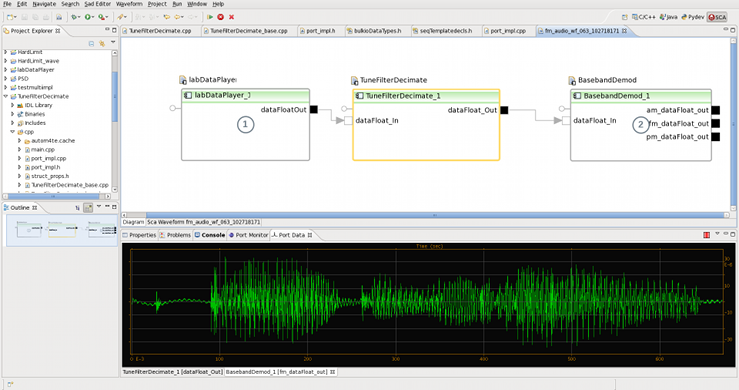

# REDHAWK

## Description
REDHAWK is a software-defined radio (SDR) framework designed to support the development, deployment, and management of real-time software radio applications. To support the design and development of software applications, REDHAWK provides tools that allow development and testing of software modules called "Components" and composition of Components into "Waveform Applications" that can be seamlessly deployed on a single computer or multiple network-enabled computers.

The REDHAWK integrated development environment (IDE) provides tools to support development of REDHAWK software. The development and deployment of REDHAWK Applications are aided by graphical editors and drag-and-drop Waveform construction. The IDE allows users to interact with and control multiple running REDHAWK instances and applications.
## Recent Announcements
**[Final Release of USRP_UHD 3.0.2 for the REDHAWK 1.10 series](https://github.com/RedhawkSDR/USRP_UHD/releases/tag/3.0.2) (May 11, 2016)** - The effort in the USRP_UHD 3.0.2 release focused on resolving the following issues in the USRP_UHD:

* Fixed error causing invalid SRI to be sent for all allocations after the initial allocation
* Added node-config script to the DeviceAdded node-config script to the Device
* Fixed error causing Ubuntu build failure

**Final Release of REDHAWK 2.0.1 (April 15, 2016)** - Download the new Core Framework, IDE, and documentation from our Downloads page. The effort in REDHAWK 2.0.1 focused on:

* Enhancing the level of control that a system deployer has to customize the reservation schema used to manage computing resources
* Adding Python operators and Java methods to simplify common arithmetic operations on BulkIO time stamps
* Addressing numerous Discrepancy Reports (DRs)
* For an overview of the new features or enhancements included in this release and information about the bug fixes and improvements of this release, refer to the [Release Notes](release-notes/redhawk-2.0.1.md)

**Final Release of REDHAWK 2.0.0 (December 10, 2015)** - Download the new Core Framework, IDE, and documentation from our Downloads page. The effort in REDHAWK 2.0 focused on improving system management, establishing a core set of REDHAWK assets, and enhancing the IDE user experience. This release will become final after the completion of an internal test event. This effort included:

* improving system scalability
* improving processing performance
* promoting consistency among core assets
* improving and focusing on a comprehensive set of core assets, including the addition of Waveforms
* providing an improved user experience by re-implementing IDE diagrams for Waveforms and Nodes
* adding IDE support for REDHAWK shared library projects
* adding IDE support for differentiating projects with namespaces

Within the Core Framework, system scalability was addressed by creating or expanding system managers (connections, allocations, and events), improving the dependency management structure for Components, and by further automating the process of distributing processing tasks. Processing performance improvements focused on NUMA balancing related to both processing and data ingest/egress. Finally, the burden on the component developer was reduced by making it easier to access system resources, simplifying properties, shifting BulkIO data management from packet-based to stream-based, and simplifying the structure of generated code.

In the IDE, diagrams were re-implemented to provide a refreshed look and a simplified, more slimlined display of diagram elements. New visualizations were added to help developers more quickly and easily create Waveforms and Nodes and monitor and debug them more easily at runtime. Shared library support was improved to enable developers to better share code between Components and Devices, while creating software that follows REDHAWK standards for easy reuse and deployment in REDHAWK systems. Namespaces were added to assist with upgrades, allowing multiple versions of a Component to be installed on the same system. Additionally, namespaces enable developers to more clearly differentiate development efforts like forked projects or contributions by different organizations.

For the REDHAWK assets, consistency was achieved by using common Port types for similar types of data and renaming Ports to establish a consistent naming convention. The set of assets was expanded to include two new assets for file I/O, a Component for decoding FM RBDS, a Component for PSK demodulation, an FEI Device simulator for generating FM RDS streams from audio files, and a set of Waveforms that collectively demonstrate the use of each Component. The set of assets was focused by removing deprecated Components (whitenoise, DataReader, DataWriter, freqfilter, medianfilter, unwrap, and BurstDeserializer). Core assets were used as examples of how to exercise new REDHAWK features. For example, domain awareness was leveraged by FileReader and FileWriter, the new BulkIO stream API was utilized by psd, sequences within struct properties were added to sinksocket, the updated shared library support was used to re-implement each shared library, and each asset was moved into the "rh" namespace.

For more information about the focus of this release, an overview of the new features or enhancements included in this release, guidance for upgrading from a previous version of REDHAWK, and information about the bug fixes and improvements of this release, refer to the [Release Notes](release-notes-2.0.0.md).

## Copyrights
This work is protected by Copyright. Please refer to the [Copyright File](COPYRIGHT) for updated copyright information.
